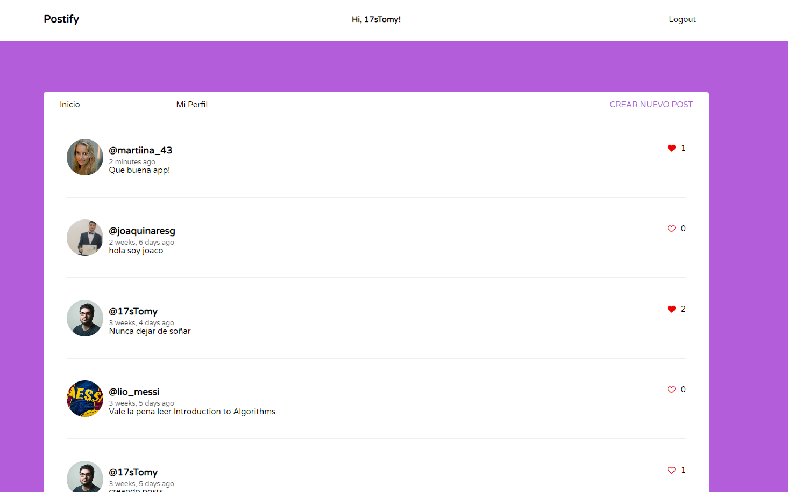

# Postify - Red Social con Django

## Descripción
Postify es una red social desarrollada con Django que te permite conectarte con amigos y compartir posts. Crea una cuenta, publica tus pensamientos, o qué estás haciendo. Postify te brinda la oportunidad de interactuar con otros usuarios mediante "likes" y personalizar tu perfil.

## Características principales
- Sistema de autenticación de usuarios: Los usuarios pueden registrarse, iniciar sesión y cerrar sesión para realizar compras y acceder a funciones adicionales.
- Publicación de contenido: Permite a los usuarios agregar posts.
- Interacción Social: Los usuarios pueden dar "likes" a publicaciones de otros usuarios.
- Sección de perfil: Muestra tus seguidores, usuarios que sigues, y posts.

## Instalación
1. Clona el repositorio: git clone https://github.com/17sTomy/postify.git
2. Instala las dependencias necesarias: pip install -r requirements.txt
3. Crea un superusuario para acceder al panel de administración: python manage.py createsuperuser
4. Inicia el servidor de desarrollo: python manage.py runserver
5. Abre tu navegador y accede a http://127.0.0.1:8000/ para ver la aplicación en funcionamiento.

